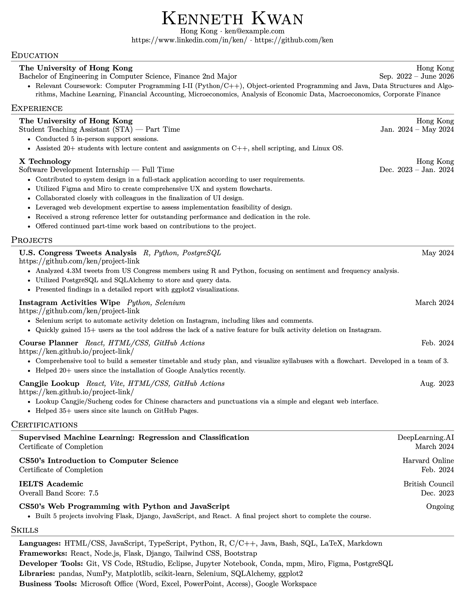

# resume-template-latex

A professional, compact resume template in LaTeX.

- Inspired by Jake's Resume (<https://github.com/jakegut/resume>)
- Didn't like Jake's version because the code was bloated and I wanted a more compact resume layout.
- This is a compact resume template with concise code and consistent formatting between sections.
- Edit the content as directed and you will end up with a professional resume of your own.
- [glyphtounicode.tex](glyphtounicode.tex) is from <https://github.com/kks32/PhDThesisLyX/blob/master/glyphtounicode.tex>

Star if it helped! Good luck on your job hunting 🌟

